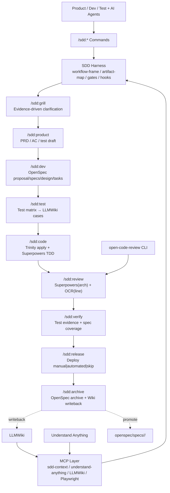
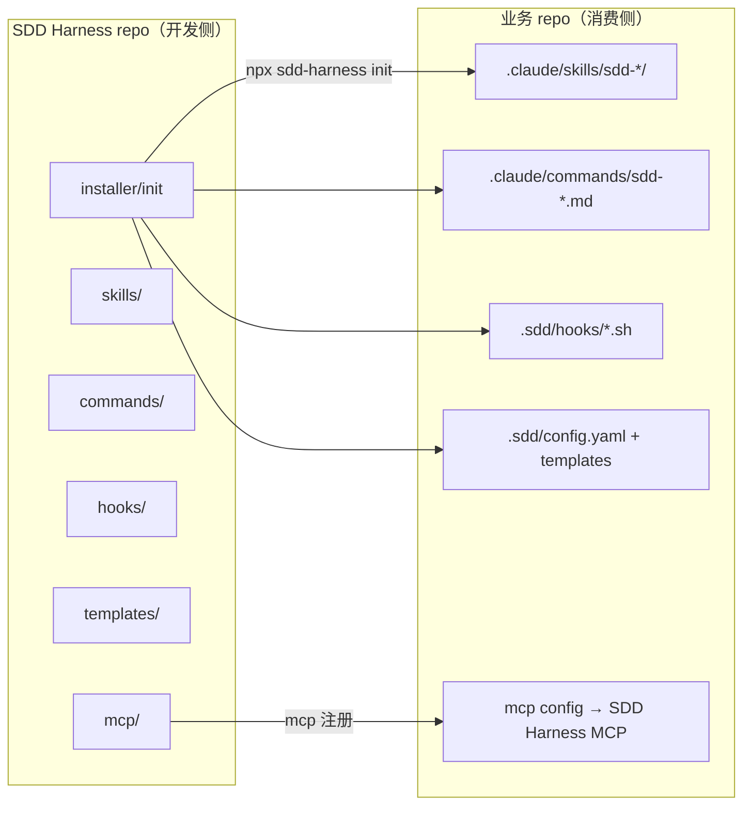
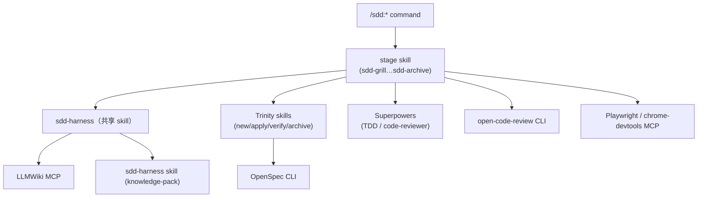

# SDD Harness Workflow Architecture

> Status: Final architecture after grill review. Supersedes the draft.
> Scope: SDD Harness —— 面向 dev team 的企业级 AI DevOps workflow wrapper，将 OpenSpec、Trinity、Superpowers、Grill、open-code-review、LLMWiki、MCP 绑定进一个带治理与知识闭环的统一 workflow。
> Current probe status: see [MiniCraft 故障探针与 SDD Harness 架构优化总结](./minicraft-harness-probe-summary.md).

## 1. Purpose & Differentiation（定位与差异化）

SDD Harness 是一个面向 **dev team**（Product / Dev / Test + AI agents；SRE 暂不纳入）的企业级 AI DevOps workflow wrapper。它把已有的开源与本地 agent 开发工具绑定进一条受治理的统一路径，不替代各工具的原生职责。

**相对 cc-sdd（3.5k stars 的成熟 SDD harness）的差异化**：cc-sdd 覆盖的是 spec→code 循环；SDD Harness 覆盖的是**完整闭环 —— knowledge → spec → code → test → review → verify → release → knowledge**，多出四样 cc-sdd 没有的东西：

1. **Knowledge closed-loop** —— 经 LLMWiki 长期沉淀 product / engineering / test / decision 知识。
2. **Structured context assembly** —— 自动聚合 MCP 信息源为结构化 context pack，agent 不需要人工翻阅每个信息源。
3. **Governance** —— hooks、gates、证据链、artifact ownership。
4. **Multi-role** —— Product / Dev / Test 围绕同一个 spec truth 协作。

依据见 ADR-0008（为什么不 fork cc-sdd）、ADR-0009（sdd-cli 底座 + 移植模式）、ADR-0010（review 作为独立 stage）。

核心理念：

```text
SDD Harness = sdd-cli 底座 + cc-sdd workflow 模式 + governance 层 + knowledge/evidence 闭环
```

## 2. Top-Level Architecture（顶层架构）



## 3. Core Decisions（核心决策）

| 决策 | 参考 |
|---|---|
| OpenSpec 是 canonical spec engine（non-negotiable） | ADR-0001 |
| 双层 OpenSpec truth：active change + accepted domain specs | ADR-0007 |
| 以 sdd-cli 为底座，不 fork cc-sdd | ADR-0008 |
| sdd-cli 底座 + 移植 cc-sdd 模式 | ADR-0009 |
| review 作为独立 stage | ADR-0010 |
| 测试用例定义 → LLMWiki；执行证据 → CI | 本文 §8 |
| `run-id = change-id`，1:1 对齐 | 本文 §6 |
| stage 在同一个 change 内可回退 | 本文 §12 |
| 9 skill + 9 command + 9 gate，由共享的 `sdd-harness` skill + 轻 gate 支撑 | 本文 §11 |

## 4. Implementation Base（实施底座）

### 4.1 sdd-cli 提供基础

sdd-cli 基于 OpenSpec 栈，已经实现了约 70% 的核心：

- `openspec/changes/<change-id>/` 目录与 schema
- tracking files：`task_plan.md`、`findings.md`、`progress.md`、`delta-log.md`
- Trinity skills：`trinity-new`、`trinity-continue`、`trinity-apply`、`trinity-verify`、`trinity-archive`
- `config.yaml`（项目身份 / context）+ `schema.yaml`（artifact DAG）
- `init` / `doctor` / `cleanup` / `list` CLI

SDD Harness 是在其上扩展，不是重造。

### 4.2 从 cc-sdd 移植的模式

五项经 cc-sdd 验证、且与 spec 格式无关的 workflow 模式，移植到 OpenSpec 底座上：

| 模式 | 在 OpenSpec 上的落地方式 |
|---|---|
| Per-task independent reviewer | `/sdd:review` 对每个 OpenSpec task 跑一次 Superpowers code-reviewer |
| Auto-debug（被拒 2 次后查根因） | `/sdd:review` 升级机制：2 次拒绝 → 新起一个干净 subagent 调查根因 |
| Boundary discipline | OpenSpec 的 `design.md` 模板加入 File Structure Plan；task 带 `_Boundary:_` / `_Depends:_` 注解 |
| Learnings propagation | 跨 task 的经验经 `findings.md` 向前传播 |
| TDD behind feature flag | `/sdd:code` 在 feature flag 后跑 RED→GREEN |

### 4.3 外部依赖

| 依赖 | 角色 |
|---|---|
| OpenSpec CLI（`brew install openspec`） | canonical spec engine |
| sdd-cli（`npx sdd-ql-workflow`） | 底座：init + Trinity skills + config/schema |
| planning-with-files skill | context tracking files |
| Superpowers | TDD、subagent 执行、code-reviewer agent |
| grill-me skill (mattpocock/skills) | pre-OpenSpec 的业务澄清 |
| open-code-review CLI（`npm i -g @alibaba-group/open-code-review`） | 行级确定性 review |
| LLMWiki MCP（`lucasastorian/llmwiki`） | 知识 + 测试用例存储 |

## 5. Stage Contracts —— 九个 stage 各自怎么跑

每个 stage 包含：一个 command、一个 wrapper skill、底层 skills/工具、可用的 MCP 能力、读写的 artifact、以及一个 gate。用户只通过 `/sdd:*` command 进入。

### 5.1 `/sdd:grill` —— 澄清

- **Wrapper skill**：`sdd-grill`（封装 grill-me + MCP context pack + discovery 路由）
- **Discovery 路由**（借鉴 cc-sdd `/kiro-discovery`）：grill 不默认建新 change，先分析意图路由到 extend / direct_impl / new / decompose，写 brief.md 支持 workstream 恢复
- **底层**：grill-me、sdd-harness skill（knowledge-pack 内联组装）
- **读取**：LLMWiki glossary、Understand-Anything graph、DeepWiki pages、OpenSpec 已有 specs
- **写入**：`openspec/changes/<id>/findings.md`（术语、边界、冲突、ADR 候选）
- **Gate（Grill）**：术语冲突已解决或显式延后；glossary 术语已写入 LLMWiki；列出 ADR 候选。

### 5.2 `/sdd:product` —— 产品草案

- **Wrapper skill**：`sdd-product`
- **底层**：to-prd、prototype、test-draft wrapper
- **读取**：grill findings、LLMWiki product 知识
- **写入**：`openspec/changes/<id>/proposal.md`（产品意图：user/problem/scope/non-goals/metrics）、`acceptance-criteria.md`、`functional-test-draft.yaml`
- **Gate（Product）**：proposal.md 存在；AC 可测；功能测试草案齐（YAML，字段：`feature` / `scenarios[]` / `happy-path` / `edge-cases` / `error-cases`，每条含 `given` / `when` / `then`）；progress 有记录。

### 5.3 `/sdd:dev` —— 工程 spec

- **Wrapper skill**：`sdd-dev`（封装 `trinity-new` + `trinity-continue`）
- **底层**：OpenSpec CLI、Understand-Anything impact paths
- **读取**：proposal、AC、knowledge-pack、code graph
- **写入**：`openspec/changes/<id>/specs/`、`design.md`（含 File Structure Plan + boundary 注解）、`tasks.md`
- **Gate（Dev）**：proposal/specs/design/tasks 齐全；有 code-graph 引用或显式说明不可用原因；已声明 test obligations。

### 5.4 `/sdd:test` —— 测试矩阵与用例

- **Wrapper skill**：`sdd-test`
- **底层**：LLMWiki MCP
- **读取**：OpenSpec scenarios、AC
- **写入**：test matrix；归一化测试用例**写入 LLMWiki**（markdown + frontmatter：`status` / `suite` / `requirement` / `last-run`）；automation 候选
- **Gate（Test）**：已产出 test matrix；用例在 LLMWiki 并经 backlink 关联到需求（traceability）；已记录 coverage gaps。

### 5.5 `/sdd:code` —— 实现

- **Wrapper skill**：`sdd-code`（封装 `trinity-apply`）
- **底层**：Superpowers TDD + subagent-driven development（可在提交前自检调用 open-code-review，正式行级 review 由 `/sdd:review` 阶段执行）
- **读取**：OpenSpec tasks、design.md boundary plan、findings.md learnings
- **写入**：代码 diff；unit/integration 测试；`.sdd/runs/<id>/code-test-output.txt` 与带输出 SHA-256 的 `code-test-report.json`；`openspec/changes/<id>/progress.md`
- **Gate（Code）**：选定的 OpenSpec task 已完成；test generation agent 未超时且 exit 0，生成前后测试清单 SHA-256 对比显示至少一个测试文件新增或修改（未变化的历史测试不算产出）；根据项目 manifest 运行真实测试命令（npm/pytest/cargo/go/maven）且 exit 0；有 Trinity tracking receipt；progress 已更新。

### 5.6 `/sdd:review` —— Review（独立 stage）

- **Wrapper skill**：`sdd-review`
- **底层**：Superpowers code-reviewer（架构、对照 spec/design 的符合度）**然后** open-code-review CLI（行级）
- **读取**：spec/design、代码 diff、progress
- **写入**：`.sdd/runs/<id>/review-notes.md`（Superpowers verdict + OCR 行级评论 + auto-debug 结果）
- **Gate（Review）**：Superpowers verdict = ready；OCR 评论已处理（已修或记为风险）；若触发，2 次拒绝的 auto-debug 已完成。

### 5.7 `/sdd:verify` —— 交付验证

- **Wrapper skill**：`sdd-verify`（封装 `trinity-verify`）
- **底层**：CI test runner 产出、Playwright 证据（功能）、chrome-devtools MCP（非功能：performance trace、Lighthouse a11y/perf）、LLMWiki coverage 查询
- **读取**：review-notes.md、测试结果、OpenSpec tasks
- **写入**：证据摘要（CI 链接 + pass/fail + Lighthouse 分数 + perf insights）写进 `progress.md`；failure 分类
- **Gate（Verify）**：tasks 完成；specs 已覆盖；功能测试/证据已收集；evidence audit 的 progress/review/test-output 输入均存在且以非 null SHA-256 绑定；非功能审计（Lighthouse/perf）已跑或显式 waiver；failure 已分类；LLMWiki coverage 已查；风险已记录。

### 5.8 `/sdd:release` —— 部署（optional，可 skip）

- **Wrapper skill**：`sdd-release`
- **Mode**：`manual`（产出 deploy checklist）| `automated`（触发 deploy pipeline + 记录结果）| `skip`（本 change 无需部署，如纯 spec/文档变更、重构，或部署由外部 CI 处理）
- **读取**：verify gate 通过、review-notes
- **写入**：release note / changelog；deploy 结果；回滚路径 或 显式 no-op；skip 模式下记录 no-deploy 理由
- **Gate（Release）**：最新 review verdict 仍为 ready；verify gate 针对当前磁盘证据重新执行并通过（硬前置，不接受历史 passed 状态）；已声明 deploy mode；manual 下有 checklist、automated 下有结果、skip 下有 no-deploy 理由；非 skip 模式下 smoke 通过或记为风险、已记录回滚路径。
- **推进**：skip 模式下 `workflow-frame.yaml` 的 stage 指针从 verify 直接跳到 archive，不阻塞。

### 5.9 `/sdd:archive` —— 归档与知识沉淀

- **Wrapper skill**：`sdd-archive`（封装 `trinity-archive`）
- **底层**：OpenSpec archive、LLMWiki MCP writeback
- **读取**：全部 artifact、verify + release gate 通过
- **写入**：accepted specs 提升到 `openspec/specs/<domain>/`（仅当 domain 已注册）；知识 writeback 到 LLMWiki；测试资产在 LLMWiki 定稿
- **Gate（Archive）**：最新 review verdict 仍为 ready；verify gate 针对当前磁盘证据重新执行并通过（不接受历史 passed 状态）；release gate 已过 **或** release mode = skip（附 no-deploy 理由）；OpenSpec archive 完成；accepted specs 已提升到 `openspec/specs/<slug>/`（或 ADR-0003 domain registry 已注册的 domain）或附理由延后；LLMWiki writeback 完成或附理由延后。

## 6. Artifact Ownership（artifact 归属）

### 6.1 两个目录，同一个 change（run-id = change-id）

```text
openspec/changes/<change-id>/        ← sdd-cli/OpenSpec 域（进 git）
  proposal.md  acceptance-criteria.md  functional-test-draft.yaml  specs/  design.md  tasks.md
  task_plan.md  findings.md  progress.md  delta-log.md

.sdd/runs/<change-id>/               ← SDD Harness 域（gitignore，ephemeral）
  workflow-frame.yaml                ← 当前 stage、目标、允许的操作（governance 核心）
  knowledge-pack.md                  ← MCP 聚合的 context pack
  review-notes.md                    ← review stage 产出（Superpowers verdict + OCR 评论）
```

canonical spec + tracking 放在 `openspec/changes/`（团队共享、进 git）；governance runtime 放在 `.sdd/runs/`（agent 工作内存、gitignore）。两者用 `change-id` 做 1:1 关联。产品草案直接写进 `proposal.md`；执行日志并入 `progress.md`；证据是写进 `progress.md` 的 CI 链接 —— `runs/` 里不堆积任何其他东西。`review-notes.md` 是工作内存（gitignore），archive 前若 session 中断导致丢失，review 阶段重跑即可（成本低，agent 重新 diff + spec/design 对照）。

### 6.2 Accepted domain specs

```text
openspec/specs/<domain>/spec.md      ← archive 后的 accepted requirements/scenarios
```

domain 必须先存在于 `.sdd/config.yaml` 的 domain registry，一个 change 才能向其写入或 archive accepted specs。**domain registry 默认关闭**（单 dev team）：关闭时 specs 直接提升到 `openspec/specs/<slug>/`（扁平 namespace，change-id 的 slug 作为 domain 名），无需注册；启用后（多 team），仅已注册 domain 可写入。见 ADR-0003。

## 7. Attention Constraint（注意力约束）

在做出重大决策、写 artifact、切换 stage、subagent 交接、context 压缩或声明完成之前，agent 必须能从文件（而非对话记忆）回答以下问题：

| 问题 | 来源 |
|---|---|
| 当前是哪个项目 / change？ | `config.yaml`、`workflow-frame.yaml` |
| 这块工作归哪个 domain？ | `config.yaml` registry、`artifact-map` |
| 当前在哪个 stage？ | `workflow-frame.yaml` |
| 下一步去哪？ | `workflow-frame.yaml`、`task_plan.md` |
| 目标是什么？ | `workflow-frame.yaml`、`proposal.md` |
| 已经学到什么？ | `knowledge-pack.md`、`findings.md` |
| 已经做了什么？ | `progress.md` |
| 现在允许做什么？ | `workflow-frame.yaml`、stage contract、hook policy |

由 hooks 强制：`SessionStart` 加载 active run/stage/obligations；`PreToolUse` 在 stage/roots 未定时阻塞写入；`PreCompact` 前先 flush findings/progress；`SubagentStop` 要求 worker 输出契约；`Stop` 在 reboot 答案/证据缺失时阻塞完成。

## 8. Testing Strategy（测试策略）

测试前置，但前置的测试 artifact 定义的是**如何验证完成**，而不是把所有测试代码都先写出来：

```text
product AC + functional test draft
→ OpenSpec scenarios
→ LLMWiki 测试用例（定义，带 frontmatter）
→ automation tasks
→ 执行证据（在 CI）
```

| 层 | 工具 |
|---|---|
| 测试用例定义（source of truth） | LLMWiki（markdown + frontmatter） |
| 执行证据 | CI runner 产出（JUnit XML 等）—— 原始结果留在 CI；摘要链接写进 `progress.md` |
| UI E2E（功能正确性） | Playwright MCP |
| 非功能审计（perf trace、Lighthouse a11y/perf） | chrome-devtools MCP |
| 后端 unit/integration | JUnit / Maven |
| 前端 unit | Vitest |

**已移除**：Kiwi TCMS、ReportPortal、Keploy、`sdd-testcase-mcp`、`sdd-reportportal-mcp`、`sdd-keploy-mcp`。测试用例定义放 LLMWiki；原始执行证据留 CI。traceability 靠 LLMWiki backlink（requirement ↔ case）—— 对 dev team MVP 够用；只有当查询/审计的痛点真实出现时，才重新引入正式 TMS。

## 9. Knowledge Closed-Loop（知识闭环）

| 系统 | 职责 |
|---|---|
| LLMWiki | 长期的 product/engineering/test/decision/glossary 知识，**以及**测试用例定义 |
| Understand-Anything | 结构化代码事实：nodes、layers、impact paths |
| DeepWiki / GitMCP | repo 文档、第三方 repo 的可读叙述 |
| OpenSpec | formal change truth + accepted domain specs |

冲突优先级：`source code > Understand-Anything > DeepWiki`；`OpenSpec > PRD`；`LLMWiki cases > functional-test-draft.yaml`。

### 9.1 LLMWiki 内容结构（标准范式 + 三大流程 + domain 组织）

SDD Harness 的 LLMWiki 严格遵循 **Karpathy LLM Wiki 标准范式**与 Google **Open Knowledge Format (OKF)** v0.1 规范。对标准范式的唯一扩展是在 `wiki/` 下增加三大流程目录（product / engineering / testing），其中 engineering 按 domain 组织。

#### 三层架构（Karpathy 范式）

```text
llmwiki/                    ← OKF bundle 根
├── index.md                # bundle 根 index（human entry）
├── log.md                  # bundle 根 log（chronological）
├── raw/                    ← ① 不可变源文档（human curated，agent 只读）
│   └── *.md, *.pdf, ...   # README、架构文档、已有 wiki、会议纪要、外部文章
│
├── wiki/                   ← ② agent 维护的知识（LLM 完全拥有此层，human 审阅）
│   ├── index.md            # 全局页目录（每页一行：链接 + 摘要 + 元数据）
│   ├── log.md              # 操作日志（ingest / query / lint，按时间 append）
│   │
│   ├── sources/            # [标准] 每个 raw source 的摘要页 + 关键提取
│   │   └── _index.md
│   ├── concepts/           # [标准] 跨流程概念页（术语深层解释、架构模式、设计原则）
│   │   └── _index.md
│   ├── entities/           # [标准] 命名实体（人、系统、外部服务、工具）
│   │   └── _index.md
│   ├── outputs/            # [标准] 查询/分析结果归档（好的 query 回答回落 wiki）
│   │   └── _index.md
│   │
│   ├── product/            # [SDD] 产品流程知识
│   │   ├── _index.md
│   │   ├── _overview.md    # 产品工作流总览
│   │   ├── requirements/   # REQ-<slug>
│   │   ├── acceptance-criteria/  # AC-<slug>
│   │   ├── user-stories/   # US-<slug>
│   │   ├── prototypes/
│   │   ├── market-research/
│   │   └── decisions/      # PD-<n>
│   │
│   ├── engineering/        # [SDD] 研发流程知识：按 domain 组织
│   │   ├── _index.md
│   │   ├── _overview.md    # 系统架构总览
│   │   └── <domain>/       # 每个 domain 一个目录（对齐 openspec/specs/<domain>/）
│   │       ├── _index.md
│   │       ├── _overview.md  # ★ agent 核心入口
│   │       ├── designs/
│   │       ├── adr/        # ADR-<n>
│   │       ├── boundaries/
│   │       ├── apis/
│   │       ├── code-notes/
│   │       └── data/
│   │
│   ├── testing/            # [SDD] 测试流程知识
│   │   ├── _index.md
│   │   ├── _overview.md
│   │   ├── cases/          # TC-<slug>
│   │   ├── suites/         # TS-<slug>
│   │   ├── matrices/
│   │   ├── plans/
│   │   ├── reports/
│   │   └── regression/
│   │
│   └── _shared/            # [SDD] 横切关联
│       ├── _index.md
│       ├── glossary/
│       ├── traceability/
│       ├── runbooks/
│       └── releases/
│
└── _schema.md              ← ③ Schema（wiki 结构约定、convention、ingest/query/lint workflow）
```

#### 标准操作（Karpathy 三操作）

| 操作 | 触发 | agent 做什么 |
|------|------|-------------|
| **Ingest** | 新 source 放入 `raw/` 或 init 首轮注入 | 读 source → 写 `wiki/sources/` 摘要 → 更新受影响的标准页 + 三大流程页 → 更新 `index.md` → 追加 `log.md` |
| **Query** | 用户/agent 问问题 | 读 `index.md` 定位相关页 → 合成答案并 citation → 好答案归档到 `wiki/outputs/` |
| **Lint** | 定期 / `sdd wiki lint` | 检查：页面间矛盾、过时声明、孤立页（无 backlink）、缺失 cross-reference、可补充的 source |

#### 标准分类与 SDD 流程的对应

| wiki/ 目录 | 来源 | 内容 |
|-----------|------|------|
| `sources/` | Karpathy 标准 | raw source 的摘要页（每篇一个 .md，frontmatter 标 source-of-truth 链接） |
| `concepts/` | Karpathy 标准 | 跨流程概念（如"认证""支付幂等""事件溯源"），多个 domain 共用 |
| `entities/` | Karpathy 标准 | 命名的外部/系统实体（如"用户""订单""支付网关""消息队列"） |
| `outputs/` | Karpathy 标准 | 查询/分析结果归档（避免好答案消失在 chat history） |
| `product/` | SDD 扩展 | 产品流程知识：REQ / AC / US / 原型 / 竞品 / 产品决策 |
| `engineering/` | SDD 扩展 | 研发流程知识：按 domain 组织（design / ADR / 边界 / API / code-notes） |
| `testing/` | SDD 扩展 | 测试流程知识：cases / suites / matrices / plans / reports / regression |
| `_shared/` | SDD 扩展 | 横切：glossary / traceability / runbooks / releases |

#### 两个服务对象

| 维度 | AI agent | 人类 |
|------|---------|------|
| 导航 | 读 `_overview.md` + frontmatter 精准聚焦；`_index.md` 扫描目录 | 读 `index.md` 层级导航；backlink 浏览 |
| 写入 | Ingest 模式：读 raw → 自动沉淀到 wiki 各层 | 通过 Obsidian / LLMWiki UI 审阅、标注、补充 `raw/` |
| 维护 | Lint 模式：定期查错、去重、补链接 | 管理 `raw/` 源文档，archive 过时内容 |

#### `_overview.md` —— agent 聚焦入口

agent 进任一层先读 `_overview.md`。以 `engineering/auth/_overview.md` 为例：

```yaml
# wiki/engineering/auth/_overview.md
domain: auth
type: overview
spec: SPEC-auth
code_roots:
  - src/auth/
  - src/middleware/auth.ts
depends_on: [user]
depended_by: [payment, order]
key_adrs: [ADR-0003, ADR-0010]
key_apis: [POST /auth/login, GET /auth/session, POST /auth/refresh]
status: active
last_updated: 2026-06-26
```

agent 读完 frontmatter 立即知道：职责边界、spec 在哪（OpenSpec backlink）、代码在哪、依赖关系——**不用满库搜**。

#### 测试用例标准格式（OKF concept）

```yaml
# wiki/testing/cases/TC-login-success.md
type: test-case
id: TC-login-success
spec: SPEC-auth
requirement: REQ-user-auth
ac: AC-login-flow
code: src/auth/login.ts
suite: TS-auth
status: active
priority: P0
last_result: pass
last_run: 2026-06-26
tags: [auth, login, smoke]
```

#### `_schema.md` —— wiki 的维护契约

`schema.md` 是 agent 维护 wiki 的"操作手册"。内容：wiki 的目录结构约定、每种页面的 frontmatter 必填字段、ingest/query/lint 的 step-by-step 流程、命名规范、链接格式、contradiction 记录方式。agent 每次操作 wiki 前先读此文件。随 wiki 使用演进由 human 和 agent 共同更新。

#### 关联机制（traceability 链）

经 frontmatter 字段 + 双向链接 `[[REQ-*]]` / `[[TC-*]]`，形成 `REQ → AC → SPEC → TC → 报告` 的 traceability 链。backlink 自动生成反向追溯；`_shared/traceability/_index.md` 汇总需求×spec×代码×测试 追溯矩阵；`/sdd:verify` 用它查 coverage gap。

#### 写入时的路由

`/sdd:product` → `wiki/product/`；`/sdd:dev`/`code`/`review` → `wiki/engineering/<domain>/` + 跨 domain 关联到 `concepts/`；`/sdd:test`/`verify` → `wiki/testing/`；`/sdd:archive` → 回写各流程目录并补 `entities/`/`concepts/` 的 backlink。Ingest 新 source 时写 `wiki/sources/` 摘要。

#### ID 体系

| 类型 | 格式 | 示例 |
|------|------|------|
| 需求 | REQ-<slug> | REQ-user-auth |
| 验收标准 | AC-<slug> | AC-login-flow |
| 规格 | SPEC-<slug> | SPEC-auth（对齐 openspec/specs/auth） |
| 产品决策 | PD-<n> | PD-001 |
| 架构决策 | ADR-<n> | ADR-0010 |
| 测试用例 | TC-<slug> | TC-login-success |
| 测试套件 | TS-<slug> | TS-auth |

#### 与 OpenSpec 的边界

**spec 全文归 OpenSpec**（`openspec/specs/`，可验证、进 git）；LLMWiki 的 `engineering/<domain>/` 存设计 / ADR / 边界 / API / code-notes，对 spec 做 backlink 引用，不重复存全文。LLMWiki 是"知识视角"，OpenSpec 是"规格真相"。
## 10. MCP Architecture（MCP 架构）

优先复用已有 MCP，只新建三个。

| 能力 | MCP |
|---|---|
| 知识 + 测试用例 | LLMWiki MCP（已有） |
| 浏览器 E2E（功能） | Playwright MCP（已有） |
| 非功能审计（perf/a11y） | chrome-devtools MCP（已有） |
| GitHub issue/PR/CI | GitHub MCP（已有） |
| 为 grill/dev/test/code/verify 组装 context pack | sdd-harness skill §4 内联组装（v2 移除独立 MCP） |
| 只读 code graph 查询 | Understand-Anything skills（已有，sdd-harness §8.5 封装调用） |
| 封装 OpenSpec/Trinity CLI 操作 | `openspec-sdd-mcp`（新建，较后 phase） |

### Context pack 契约（sdd-harness skill `build_knowledge_pack`）

```yaml
run_id: ""
phase: grill | dev | test | code | verify
user_intent: ""
product_context: { wiki_pages: [], glossary_terms: [], open_questions: [] }
code_context: { understand_graph_commit: "", related_nodes: [], layers: [], impact_paths: [] }
test_context: { existing_cases: [], regression_risks: [] }
openspec_context: { active_change: "", related_changes: [] }
evidence: { sources: [] }
```

**数据源优先级**：OpenSpec > LLMWiki > git diff > Understand-Anything > DeepWiki。冲突按优先级覆盖，冲突标记在 knowledge-pack 末尾 `## Conflicts` 段。

**新鲜度策略（MVP）**：每次 build 都重新聚合全部源，不做增量缓存。单 change 规模下 token 开销可控，实现简单。

## 11. Hooks & Gates

### 11.1 Hooks（轻量 —— 治理，不是官僚）

| Hook | 职责 | MVP? |
|---|---|---|
| `SessionStart` | 加载 active run、domain、stage、obligations | 是 |
| `PreToolUse`（Edit/Write/Bash） | 阻止越界写入、wrong-phase 写入 | 是 |
| `PreToolUse`（mcp__*） | 阻止 wrong-phase 的 MCP 写入 | 后续 |
| `PostToolUse` | 记录写活动；提醒更新 progress/evidence | 后续 |
| `Stop` | artifact/evidence/writeback 缺失时阻塞完成 | 是 |
| `PreCompact` | context 丢失前 flush findings/progress | 是（MVP 自动） |
| `SubagentStop` | 要求 worker 输出契约（domain、subfeature、artifact、evidence、risk） | 是（MVP 自动） |
| `UserPromptSubmit` | 阻止绕过 `/sdd:*` 入口的复杂工作 | 后续 |

**注意**：`SubagentStop` hook 从 subagent 最终消息文本中检测输出契约（domain/subfeature/artifact/evidence/risk），走 prompt 约束 + 正则/关键词解析，不是结构性强制。

MVP 发 5 个 hook（SessionStart、PreToolUse、Stop、PreCompact、SubagentStop）。**hook override 方向**（Phase 2 定案）：候选为 `config.yaml` allowlist 或 `--force` bypass；所有 block 写入 `.sdd/hooks/block-log.md`。

### 11.2 Gates（轻量 —— 只查存在性 + verdict）

每个 gate 读取 `workflow-frame.yaml` 并检查必备 artifact 是否存在；不跑重活（测试/review 在各自 stage 跑完，gate 只验产出存在）。共 9 个 gate：Grill、Product、Dev、Test、Code、Review、Verify、Release、Archive —— 已在 §5 内联定义。

### 11.3 Skills

9 个 stage skill（`sdd-grill` … `sdd-archive`）是**薄壳**，底层共用一个 `sdd-harness` skill 负责公共逻辑：artifact 读写、stage 推进、gate 检查、knowledge-pack 组装、LLMWiki 操作。9 个里有 4 个封装现有 Trinity skill（dev/code/verify/archive）。progressive disclosure 只加载当前 stage 的 skill。

## 12. Reversibility & Parallelism（可逆性与并行）

### 12.1 change 内回退（stage 可逆）

如果 review/verify 暴露了上游错误，把 `workflow-frame.yaml` 里的 stage 指针拨回去（如 review → dev），`progress.md` 记录 `reverted: review → dev, reason: …`，下游 artifact 标记为 `superseded`（不删除）。`change-id` 不变；证据链不断。一个 hook 在回退时校验下游 artifact 已标 superseded。

恢复、迁移或接管历史 run 时，先运行 `sdd workflow-audit --project <dir> --run <id> --json`。
该命令不信任 frame 中声明的 `status: passed`，而是针对当前 stage 重新执行持续成立的
review/verify 前置 gate；声明为 release/archive 但证据不成立时返回 exit 2，要求回退。

### 12.2 worktree 并行研发

多个 change 并行推进，每个占一个 git worktree：

```text
worktree-1 (feat-auth)    → openspec/changes/add-auth-7f3a/    + .sdd/runs/add-auth-7f3a/
worktree-2 (feat-payment) → openspec/changes/add-payment-2b1d/ + .sdd/runs/add-payment-2b1d/
```

三个硬前提（Phase 8 补冲突检测与 wiki 一致性，单 team MVP 不触发）：

1. **并发下 change-id 唯一** —— `<slug>-<4位 hash>`（如 `add-auth-7f3a`）；agent 创建时自动加后缀，主 slug 保持可读。
2. **`.sdd/runs/` 全部 gitignore** —— runtime 状态绝不进 git（避免 worktree 间合并冲突、仓库膨胀）。`openspec/changes/` 的 tracking 文件**进 git**（团队要看到进度）。
3. **每个 worktree 都要有 hooks** —— sdd-cli `init`（扩展版）把 `.claude/settings.json` + `.sdd/hooks/` 拷进每个 worktree 根，不只装主仓。

**已知 gap（Phase 8）**：并发 change 冲突检测 —— `sdd conflict check` 对比各 worktree 触碰的 spec 文件交集（Phase 8 加）；LLMWiki 多 worktree 写入的一致性 —— Phase 8 前用乐观并发（后写覆盖 + `log.md` 记录冲突）。单 team MVP 通常单 worktree，不触发。

## 13. Initialization —— 如何把 SDD Harness 装起来

### 13.1 项目级 init（一键全装，每个 repo/worktree 一次）

`sdd init` 默认**一键装齐全部依赖**并完成首轮代码架构整理，业务 repo init 完即可跑完整 9 阶段，不靠后续逐 stage 发现缺件。

```text
sdd init 流程：
  1. pre-doctor        —— 检测环境，列出待装项与权限（brew / npm -g 是否需 sudo）
  2. 装系统级 CLI      —— OpenSpec CLI（brew install openspec）、open-code-review（npm i -g）
  3. clone skills      —— Superpowers / planning-with-files / grill-me → 平台 skills 目录
  4. 装 MCP servers    —— LLMWiki / Playwright / chrome-devtools → 注册 MCP config + 生成 `~/.sdd/mcp-keys.env` 模板（endpoint/key 统一管理，防进 git）
  5. LLMWiki 初始化    —— 建 wiki 实例 + SDD 知识分类骨架 + 可选首轮文档注入
  6. 装 Understand-Anything + 首轮代码架构整理
                        —— 扫描业务 repo，生成 .understand-anything/knowledge-graph.json
  7. 落 SDD Harness 层 —— 9 个 sdd-* skill + commands + hooks + templates + config.yaml
  8. post-doctor       —— 确认全部就绪，输出 stage readiness 全绿（或标注待填项）

可选：
  sdd init --minimal   —— 只装 core required，跳过 stage/optional 依赖与架构整理（精简环境）
  sdd init --worktree  —— worktree 内轻量 init（只落 hooks/config，依赖共享自主仓）
  sdd graph refresh    —— 代码大改后重新生成 knowledge-graph.json
  sdd wiki init        —— 单独重跑 LLMWiki 初始化（建库 / 重建分类骨架）
  # steering：.sdd/steering/project.md 由 init 自动建模板，跨 change 持久指导
  sdd upgrade          —— 从 sdd-cli 升级到 SDD Harness（备份旧 config + 覆盖安装，保留 openspec/changes/）
```

`init` 检测平台（Claude Code / OpenCode / Codex）装进对应目录。

**LLMWiki 初始化（step 5）**：装完 MCP server 后初始化 LLMWiki 实例——建 §9.1 的标准三层架构（`raw/` 不可变源文档 + `wiki/` agent 维护的知识 + `_schema.md` 维护契约），在 `wiki/` 下建标准分类（sources / concepts / entities / outputs）+ SDD 三大流程骨架（product / engineering / testing + `_shared`，其中 engineering 按 domain 子目录）+ ID 体系，配 MCP endpoint。可选首轮注入：把业务 repo 已有的 README / 架构文档等灌入 `raw/`，跑首次 ingest 生成 `wiki/sources/` 摘要并初始化标准页与流程目录——作为初始知识底座，避免空库起步。`/sdd:product` / `dev` / `test` / `archive` 写入时标准三层已就位。

**Understand-Anything 首轮整理（step 6）**：装完立即对业务 repo 跑首轮代码架构分析，产出 nodes / layers / impact paths 知识图谱（`.understand-anything/knowledge-graph.json`）。这一步是后续 `/sdd:dev`（impact 分析）、`/sdd:test`（回归风险定位）、`/sdd:review`（boundary 检查）的 code graph 基础——init 时就绪，避免进 dev 才发现图谱为空。产物是代码的派生快照、随代码变动，建议 gitignore，用 `sdd graph refresh` 在大改后重生成。

worktree 工作流里，依赖由主仓 init 一次装齐，每个新 worktree 只跑 `sdd init --worktree` 落本地 hooks/config 即可。

### 13.2 `.sdd/config.yaml`（在 OpenSpec config 之上的 SDD Harness 扩展）

```yaml
schema: trinity-workflow-v2
context: |                          # 项目身份（来自 sdd-cli）
  Tech stack: <语言/框架>
  Code style: <规范>
hooks:
  mvp: [SessionStart, PreToolUse, Stop, PreCompact, SubagentStop]
review:
  architecture: superpowers-code-reviewer   # 在 /sdd:review 里先跑
  line_level: open-code-review              # 后跑，CLI
  auto_debug_after_rejections: 2
knowledge:
  backend: llmwiki-mcp                      # 或 obsidian-mcp
  sediment_on: archive
domain_registry:
  enabled: false                            # 单 dev team 关闭；多 team 时打开
  domains: []
```

### 13.3 每个 run 的 init（change 开始时）

`/sdd:grill`（第一个 stage）初始化 run：

1. 生成 `change-id` = `<slug>-<4位 hash>`；创建 `openspec/changes/<change-id>/`。
2. `trinity-new` 脚手架生成 proposal/specs/design/tasks 占位 + tracking 文件。
3. 写 `.sdd/runs/<change-id>/workflow-frame.yaml`（stage = grill、目标、允许的操作）。
4. sdd-harness skill 内联组装 `.sdd/runs/<change-id>/knowledge-pack.md`。

后续每个 `/sdd:*` command 读取 `workflow-frame.yaml`，在 gate 通过后推进 stage 指针，并更新 `progress.md`。

### 13.4 Hook 接线示意（`.claude/settings.json`）

```json
{
  "hooks": {
    "SessionStart": [{ "matcher": "startup|resume",
      "hooks": [{ "type": "command", "command": "${CLAUDE_PROJECT_DIR}/.sdd/hooks/session-start.sh" }]}],
    "PreToolUse": [{ "matcher": "Edit|Write|MultiEdit|Bash",
      "hooks": [{ "type": "command", "command": "${CLAUDE_PROJECT_DIR}/.sdd/hooks/pre-tool-gate.sh" }]}],
    "PreCompact": [{ "matcher": "manual|auto",
      "hooks": [{ "type": "command", "command": "${CLAUDE_PROJECT_DIR}/.sdd/hooks/pre-compact-save.sh" }]}],
    "SubagentStop": [{
      "hooks": [{
        "type": "command",
        "command": "${CLAUDE_PROJECT_DIR}/.sdd/hooks/subagent-stop-contract.sh"
      }]
    }],
    "Stop": [{ "hooks": [{ "type": "command", "command": "${CLAUDE_PROJECT_DIR}/.sdd/hooks/stop-gate.sh" }]}]
  }
}
```

### 13.5 依赖识别与安装（doctor 机制）

SDD Harness 依赖一批外部基础框架（CLI / skills / MCP），`init` 不能假设它们都已就位。用**分层依赖 + `doctor` 检测 + stage 级 readiness** 机制识别与安装。

依赖分三层：

| 层 | 含义 | 何时检查 |
|---|---|---|
| **core required** | 缺了 SDD Harness 无法启动 | `init` 时强制；缺失则拒绝继续 |
| **stage required** | 某个 stage 才需要 | 进入该 stage 时由 doctor 检查；缺失则提示安装或该 stage 降级 |
| **optional** | 增强，非必需 | doctor 报告，不阻塞 |

依赖清单（声明在 SDD Harness repo 的 `dependencies.yaml`，由 `sdd doctor` 读取，见 §14.2）：

| 依赖 | 层 | 用途 | 安装 | 检测 |
|---|---|---|---|---|
| Node.js | core | 运行时 | 系统包管理器 | `node -v` |
| Git | core | 运行时 | 系统包管理器 | `git --version` |
| OpenSpec CLI | core | canonical spec engine | `brew install openspec` | `openspec --version` |
| Superpowers（skill） | core | TDD + code-reviewer | clone 到 skills 目录 | 文件存在 |
| planning-with-files（skill） | core | sdd-cli 底层 tracking | clone 到 skills 目录 | 文件存在 |
| grill-me（skill） | stage·grill | 业务澄清 | clone 到 skills 目录 | 文件存在 |
| open-code-review CLI | stage·review | 行级 review | `npm i -g @alibaba-group/open-code-review` | `ocr --version` |
| LLMWiki MCP | stage·test/archive | 知识 + 用例 | MCP config 注册 | MCP 连通 |
| Playwright MCP | stage·verify | 功能 E2E | MCP config 注册 | MCP 连通 |
| chrome-devtools MCP | stage·verify | 非功能审计 | MCP config 注册 | MCP 连通 |
| Understand-Anything | core | code graph（dev/test/review 基础） | clone + init 首轮整理 | 文件存在 |
| GitHub MCP | optional | issue / PR / CI | MCP config 注册 | MCP 连通 |

机制：

- **`sdd doctor`**（扩展自 sdd-cli）：检测全部依赖，输出 `✅ installed / ❌ missing / ⚠️ wrong-version`，对 missing 项给出安装命令；最后给出每个 stage 的 readiness。
- **`sdd init`**（见 §13.1）：默认**一键装齐全部依赖**（core + stage + optional）+ Understand-Anything 首轮代码架构整理；`--minimal` 只装 core required。
- **stage 级检查（运行时兜底）**：默认 init 已全装；若运行中某依赖被卸载或失效，进该 stage 时 doctor 兜底检测，提示重装或降级（verify 缺 Playwright → 只用 CI 证据；review 缺 open-code-review → 只跑 Superpowers）。

doctor 输出示意：

```text
$ sdd doctor
✅ Node.js v20.5.0
✅ Git 2.43.0
✅ OpenSpec CLI 1.2.0
✅ Superpowers
❌ planning-with-files — git clone https://github.com/OthmanAdi/planning-with-files ~/.claude/skills/planning-with-files
⚠️ open-code-review CLI — npm i -g @alibaba-group/open-code-review   (review 阶段需要)
⚠️ LLMWiki MCP — 未配置                                            (test/archive 阶段需要)

stage readiness:
  grill          ✅ ready
  product        ✅ ready
  dev            ✅ ready
  test/archive   ⚠️ 缺 LLMWiki（用例将无法持久化）
  code           ✅ ready
  review         ⚠️ 缺 open-code-review（将只用 Superpowers）
  verify         ⚠️ 缺 Playwright/chrome-devtools（将只用 CI 证据）
  release        ✅ ready
```

---

## 14. SDD Harness Repo（开发指导）

这一章回答：SDD Harness 本身作为一个可分发的 repo，要开发哪些组件、如何组织、如何被业务 repo 集成。它是对标 sdd-cli、cc-sdd 的**独立 toolchain repo**，不是业务 repo 的一部分。

### 14.1 Repo 定位与分发

SDD Harness repo **fork 自 sdd-ql-workflow（ql-wade/sdd-cli）并演进**，是一个可分发的 toolchain repo：既是 npm 包（installer + 可能的 MCP 运行时），又是 skill 包（装给 Claude Code / OpenCode / Codex 的 skills + commands + hooks）。对标 cc-sdd 的形态。

- **npm 分发**：`npx @yourorg/sdd-harness init`（fork 自 `npx sdd-ql-workflow init`）
- **跨平台检测**：Claude Code / OpenCode / Codex，装进对应 skill / command 目录
- **MCP 独立发布**：每个 MCP 作为独立 npm 子包或独立 repo，业务 repo 的 MCP config 引用
- **fork 关系**：保留 sdd-cli 的 `init` / `doctor` / `cleanup` CLI + trinity skills + config/schema 体系；在其上加 9 个 sdd-* stage skill + `sdd-harness` 共享 skill + hooks + MCP + templates + governance。上游 sdd-cli 有更新时 rebase / merge。

### 14.2 Repo 目录结构

```text
sdd-harness/                          ← SDD Harness 自己的 repo
├── skills/
│   ├── sdd-harness/                  ← 共享 skill（artifact 读写、stage 推进、gate、knowledge-pack 组装、LLMWiki 操作）
│   ├── sdd-grill/                    ← 9 个 stage skill（薄壳）
│   ├── sdd-product/
│   ├── sdd-dev/
│   ├── sdd-test/
│   ├── sdd-code/
│   ├── sdd-review/
│   ├── sdd-verify/
│   ├── sdd-release/
│   └── sdd-archive/
├── commands/
│   └── sdd-{grill,product,dev,test,code,review,verify,release,archive}.md
├── mcp/
│   └── openspec-sdd-mcp/              ← v2: sdd-context-mcp 已移除（knowledge-pack 下沉 skill）
├── hooks/
│   ├── session-start.sh
│   ├── pre-tool-gate.sh
│   ├── stop-gate.sh
│   ├── pre-compact-save.sh
│   └── subagent-stop-contract.sh
├── templates/
│   ├── workflow-frame.yaml
│   ├── knowledge-pack.md
│   ├── review-notes.md
│   └── config.yaml
├── dependencies.yaml               ← 外部依赖清单（core/stage/optional，doctor 读取）
├── installer/
│   └── init.ts                       ← sdd-cli init 的 SDD Harness 扩展
└── package.json
```

### 14.3 Skill 清单（交付物）

10 个 skill = 1 个共享 + 9 个 stage 薄壳。每个 stage skill 只做"阶段特定逻辑 + 调 `sdd-harness` 共享逻辑"，不重复公共代码（progressive disclosure 只加载当前 stage）。

| skill | 职责 | 读 | 写 | 依赖 |
|---|---|---|---|---|
| `sdd-harness`（共享） | artifact 读写、stage 推进、gate 检查、knowledge-pack 组装、LLMWiki 操作 | workflow-frame, config | workflow-frame, progress | LLMWiki MCP |
| `sdd-grill` | 业务澄清 | grill context pack | findings.md | grill-me, sdd-harness skill |
| `sdd-product` | 产品草案 | findings | proposal.md, AC, test draft | to-prd, prototype |
| `sdd-dev` | spec / design / tasks | proposal, AC, code graph | specs/, design.md, tasks.md | trinity-new/continue, Understand-Anything skills（via sdd-harness） |
| `sdd-test` | 测试矩阵 + 用例 | scenarios, AC | LLMWiki cases | LLMWiki MCP |
| `sdd-code` | 实现 | tasks, design, findings | code diff, tests, progress | trinity-apply, Superpowers |
| `sdd-review` | review（先架构后行级） | spec/design, diff | review-notes.md | Superpowers code-reviewer, open-code-review CLI |
| `sdd-verify` | 交付验证（功能 + 非功能） | review-notes, 测试结果 | progress（evidence） | trinity-verify, Playwright / chrome-devtools MCP |
| `sdd-release` | 部署（可 skip） | verify pass | release note, deploy 结果 | 外部 deploy pipeline |
| `sdd-archive` | 归档 + 知识沉淀 | 全部 | openspec/specs/, LLMWiki writeback | trinity-archive, LLMWiki MCP |

### 14.4 MCP 清单（交付物）

新建 3 个，复用 4 个已有。

| MCP | 类型 | 核心 tools | 依赖 | Phase |
|---|---|---|---|---|
| ~~`sdd-context-mcp`~~ | ~~新建~~ | _v2 移除：knowledge-pack 组装下沉到 sdd-harness skill §4，避免 stub + 职责重叠_ | — | — |
| `openspec-sdd-mcp` | 新建 | 把 trinity / openspec CLI 操作封装为 MCP tools | OpenSpec CLI、sdd-cli | Phase 8 |
| LLMWiki MCP | 复用 | 知识读写 + 测试用例 CRUD | `lucasastorian/llmwiki` | Phase 5 |
| Playwright MCP | 复用 | 功能 E2E | `microsoft/playwright-mcp` | Phase 6 |
| chrome-devtools MCP | 复用 | perf trace、Lighthouse a11y/perf | `ChromeDevTools/chrome-devtools-mcp` | Phase 6 |
| GitHub MCP | 复用 | issue / PR / CI | 官方 GitHub MCP | 按需 |

### 14.5 Hook 清单

见 §11.1。MVP 5 个（`session-start` / `pre-tool-gate` / `stop-gate` / `pre-compact-save` / `subagent-stop-contract`），脚本放 repo 的 `hooks/`，init 时拷进业务 repo 的 `.sdd/hooks/`。

### 14.6 集成方式（开发侧 → 消费侧）



装配流程（与 §13 互补，§13 是使用者视角，这里是开发者交付视角）：

1. 业务 repo 跑 `npx sdd-harness init`（或扩展 sdd-cli `init`）。
2. init 检测平台，把 `skills/`、`commands/` 拷进业务 repo 的 `.claude/`（或 `.opencode/` / `.codex/`）。
3. init 把 `hooks/` 拷进 `.sdd/hooks/`，并改写 `.claude/settings.json` 接线（见 §13.4）。
4. init 落 `templates/` 到 `.sdd/`，写 `.sdd/config.yaml`，把 `.sdd/runs/` 加入 `.gitignore`。
5. MCP：业务 repo 的 MCP config 注册 SDD Harness 的 3 个 MCP server（指向 npm 全局安装路径或容器）。

### 14.7 依赖与调用关系



调用规则：

- stage skill 是入口，先调 `sdd-harness` 做 stage 推进 / gate，再做阶段特定工作。
- spec 状态一律经 Trinity / OpenSpec CLI（或 `openspec-sdd-mcp`），stage skill 不直接写 `openspec/`。
- review 的 Superpowers 与 open-code-review 顺序由 `sdd-review` 编排（先架构后行级）。
- LLMWiki 操作集中在 `sdd-harness` 共享逻辑，避免 9 个 skill 各写一遍。

---

## 15. Implementation Phases（实施阶段）

- **Phase 0 —— Freeze**：确认 OpenSpec 为唯一 canonical spec source；确认 sdd-cli 为底座；确认 `/sdd:*` 为用户入口。
- **Phase 1 —— Skills 与 commands**：9 个 stage skill + `sdd-harness` 共享 skill；9 个 `/sdd:*` command；`workflow-frame.yaml` / `knowledge-pack.md` / `review-notes.md` 模板；扩展 sdd-cli `init`。
- **Phase 2 —— Hook MVP**：5 个 hook（SessionStart、PreToolUse、Stop、PreCompact、SubagentStop）；接好 settings.json；只拦三件事：无 active run 的复杂工作、wrong-phase 写入、必备 artifact/evidence 缺失就 stop。
- **Phase 3 —— Review stage**：把 Superpowers code-reviewer + open-code-review CLI 接进 `/sdd:review`；移植 auto-debug + boundary discipline + learnings propagation。
- **Phase 4 —— knowledge-pack 组装**：sdd-harness skill §4 内联组装（聚合本地文件、OpenSpec、git diff、LLMWiki pages → `knowledge-pack.md`）；code graph 查询集成 Understand-Anything 已有 skills（sdd-harness §8.5 封装）。_v2：原 sdd-context-mcp 移除，下沉 skill。_
- **Phase 5 —— Knowledge 闭环**：`/sdd:test` 用 LLMWiki 写测试用例定义；`/sdd:archive` 做 LLMWiki writeback。
- **Phase 6 —— Release stage**：`/sdd:release` 的 manual + automated + skip 模式；skip 路径放行 verify → archive。
- **Phase 7 —— 全流程试跑**：在一个 worktree 里把一个 change 从 grill 跑到 archive。
- **Phase 8 —— 规模触发**：domain registry（当并发 change >1 或多 team 时）；`openspec-sdd-mcp`；剩余 hooks（UserPromptSubmit、PostToolUse、mcp tool gate）。

## 16. Evidence Sources（证据来源）

- OpenSpec: <https://github.com/Fission-AI/openspec> · <https://openspec.dev>
- sdd-cli（底座）: <https://github.com/ql-wade/sdd-cli>
- cc-sdd（workflow 模式参考，非代码 fork）: <https://github.com/gotalab/cc-sdd>
- cc-sdd × SDD Harness 全量对比: 见 `docs/architecture/cc-sdd-comparison.md`（本 repo）
- Superpowers: <https://github.com/obra/superpowers>
- Claude Code hooks: <https://docs.anthropic.com/en/docs/claude-code/hooks>
- MCP TypeScript SDK: <https://github.com/modelcontextprotocol/typescript-sdk>
- Understand Anything: <https://github.com/Egonex-AI/Understand-Anything>
- LLMWiki（知识 + 用例）: <https://github.com/lucasastorian/llmwiki>
- Open Knowledge Format (OKF) v0.1（LLMWiki 结构遵循的规范）: <https://github.com/GoogleCloudPlatform/knowledge-catalog/blob/main/okf/SPEC.md>
- Karpathy LLM Wiki（OKF 前身模式）: <https://gist.github.com/karpathy/442a6bf555914893e9891c11519de94f>
- open-code-review（行级 review）: <https://github.com/alibaba/open-code-review>
- Playwright MCP: <https://github.com/microsoft/playwright-mcp>
- chrome-devtools MCP（perf/a11y 审计）: <https://github.com/ChromeDevTools/chrome-devtools-mcp>
